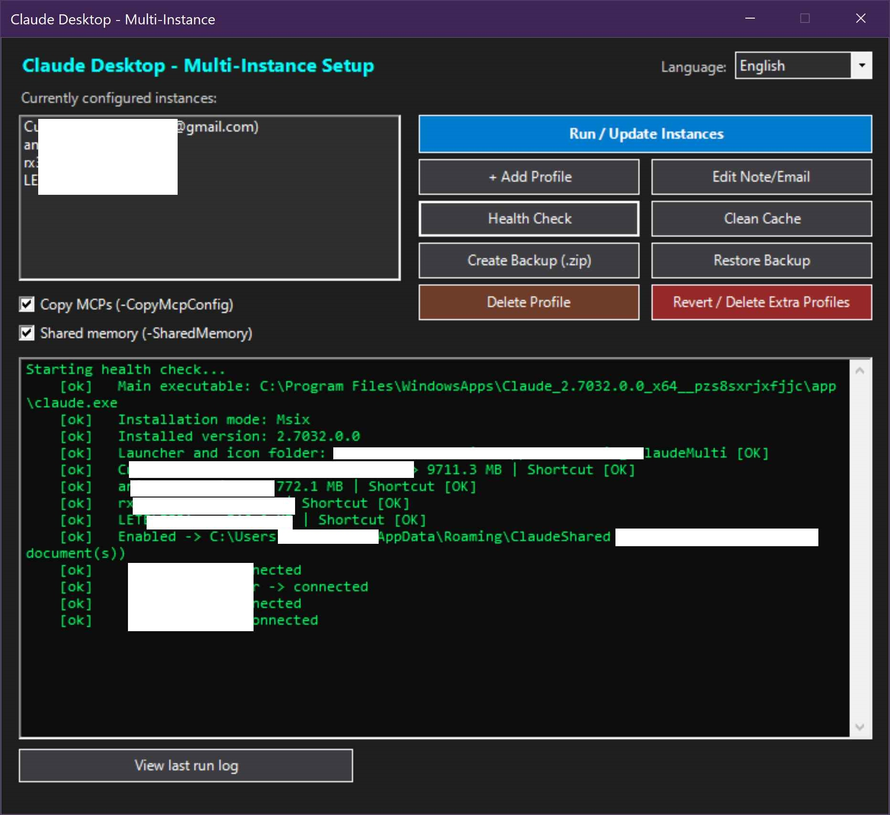

**[English](README.md)** | **[Español](README.es.md)**

---

# Claude Desktop - Multi-Instancia (`Setup-ClaudeMulti`)

Script de automatización en PowerShell para ejecutar **múltiples instancias simultáneas de Claude Desktop en paralelo** en Windows, cada una con su propia cuenta, sesión, historial local, servidores MCP y configuración independiente.

Anthropic no ofrece soporte nativo para el cambio o uso simultáneo de cuentas en Claude Desktop: obliga a cerrar sesión y autenticarse nuevamente cada vez. Este proyecto elimina esa restricción de forma transparente y segura.

<p align="center">
  
</p>

---

## Características Principales

- **Detección Automática e Internacionalización (Español / Inglés):** Detecta automáticamente el idioma del sistema operativo (Windows en español $\rightarrow$ Español; cualquier otro idioma $\rightarrow$ Inglés). Además permite forzar y cambiar el idioma manualmente en cualquier momento.
- **Interfaz Gráfica Nativa (GUI Windows Forms):** Administra, añade, edita notas/emails y elimina perfiles con un solo clic. Incluye selector de idioma en caliente.
- **Iconos Únicos por Color:** Genera automáticamente iconos `.ico` multi-resolución con insignias de colores distintos para identificar visualmente cada acceso directo en el escritorio.
- **Compatibilidad Total (MSIX y Exe Tradicional):** Funciona tanto con la versión de Microsoft Store (MSIX) mediante copia portable auto-gestionada en `C:\ClaudePortable` como con instaladores clásicos.
- **Actualizaciones Automáticas Seguras:** Verifica la versión de Claude Desktop al abrir cualquier perfil. Si la app se actualizó, prepara y valida una copia nueva sin romper perfiles activos.
- **Memoria Compartida MCP (Opcional):** Permite interconectar todas las cuentas a una memoria de contexto común (`memory.json`) y carpeta compartida de archivos mediante MCP.
- **Registro de Diagnóstico (`last-run.log`):** Registra cada ejecución en `%APPDATA%\ClaudeMulti\last-run.log` para facilitar la resolución de problemas.
- **Suite de Pruebas Integrada:** Incluye tests automatizados para validar lanzadores, gestión de procesos, copias portables y logs.

---

## El Problema y la Solución

Claude Desktop guarda **todo** el estado del usuario —incluido el token de sesión y configuración— en una única carpeta *user data* (`%APPDATA%\Claude`). Al existir solo una carpeta predeterminada, solo una cuenta puede estar activa a la vez.

```
ANTES    →  Cerrar sesión → login cuenta B → trabajar → cerrar sesión → login cuenta A...
DESPUÉS  →  Múltiples ventanas abiertas al mismo tiempo, una por cuenta.
```

Dado que Claude Desktop está basado en Electron, acepta el flag `--user-data-dir`. Al invocar el ejecutable asignando rutas independientes (`%APPDATA%\Claude-<Nombre>`), cada ventana trabaja en un entorno completamente aislado.

---

## Detección y Selección de Idioma

El proyecto soporta **Español** e **Inglés** de forma completa:

1. **Detección Automática:**
   - Si Windows está configurado en español (`es-*`), el asistente y los accesos directos se inician en **Español**.
   - En cualquier otro idioma de Windows (`en`, `fr`, `de`, `pt`, etc.), se inician en **Inglés**.

2. **Selección Manual Forzada:**
   - **En la Interfaz Gráfica (GUI):** Usa el menú desplegable de idioma en la esquina superior derecha (`Español` / `English`). La interfaz se traduce al instante y guarda tu preferencia.
   - **En el Menú de Consola (CLI):** Selecciona la opción `[13] Cambiar idioma / Change language`.
   - **Por Línea de Comandos:** Pasa el parámetro `-Language en` o `-Language es`.
   - **Persistencia:** La preferencia forzada se guarda en `%APPDATA%\ClaudeMulti\config.json` para recordarla en futuros arranques.

---

## Instalación y Uso Rápido

### 1. Descarga del Proyecto

> [!NOTE]
> Al ser una herramienta basada en scripts de PowerShell y Batch, **no se utilizan instaladores compilados ni sección de Releases**. Para obtener la versión más reciente:

1. En la página principal del repositorio en GitHub, haz clic en el botón verde **`<> Code`**.
2. Selecciona la opción **`Download ZIP`** (o bien clona el repositorio con `git clone https://github.com/rx32555/ClaudeDesktop_MultiInstancia.git`).
3. Descomprime el archivo `.zip` descargado en cualquier carpeta fija de tu equipo.

---

### 2. Archivos Incluidos

| Archivo | Descripción |
|---------|-------------|
| `Setup-ClaudeMulti.ps1` | Script principal de configuración, GUI, CLI y lógica de negocio |
| `Setup-ClaudeMulti.bat` | Lanzador directo con detección de idioma del entorno (ejecuta PowerShell sin problemas de ExecutionPolicy) |

> Ambos archivos deben permanecer juntos en la misma carpeta.

---

### 3. Modo Gráfico (Recomendado)

1. Entra a la carpeta descomprimida y haz doble clic sobre **`Setup-ClaudeMulti.bat`**.
2. Se abrirá la **Interfaz Gráfica de Usuario (GUI nativa)**:
   - **Selector de Idioma:** En la parte superior derecha para alternar entre Español e Inglés.
   - **Lista de Perfiles Activos:** Muestra cada cuenta con sus notas o correos asociados.
   - **Ejecutar / Actualizar Instancias:** Configura y deja listos los accesos directos.
   - **Añadir Perfil:** Crea una nueva cuenta (`Trabajo`, `Cliente`, `Cuenta4`, etc.) manteniendo intactas las existentes.
   - **Editar Nota/Email:** Asigna etiquetas descriptivas (ej. `personal@gmail.com`, `empresa@trabajo.com`).
   - **Memoria compartida (casilla):** Configura servidores MCP comunes para compartir contexto entre instancias.
   - **Health Check:** Diagnostica ejecutables, accesos directos, tamaño en disco de perfiles y detecta perfiles huérfanos.
   - **Limpiar Caché:** Libera espacio purgando cachés temporales y versiones obsoletas de binarios.
   - **Crear / Restaurar Backup:** Genera un respaldo `.zip` con sesiones y configuración (omitiendo cachés pesadas).
   - **Eliminar Perfil:** Remueve de forma limpia el perfil seleccionado preservando el resto.
   - **Ver registro:** Abre el archivo de registro de la última ejecución en el bloc de notas.

---

### 4. Modo Consola / Terminal

Si prefieres usar la consola o automatizar via scripts:

```powershell
# Ejecutar en modo CLI interactivo
powershell -ExecutionPolicy Bypass -File .\Setup-ClaudeMulti.ps1 -CLI

# Forzar idioma en inglés o español
powershell -ExecutionPolicy Bypass -File .\Setup-ClaudeMulti.ps1 -Language en
powershell -ExecutionPolicy Bypass -File .\Setup-ClaudeMulti.ps1 -Language es

# Crear perfiles con nombres específicos y heredar los MCPs configurados
powershell -ExecutionPolicy Bypass -File .\Setup-ClaudeMulti.ps1 -Profiles 'Personal','Trabajo','Cliente' -CopyMcpConfig

# Crear perfiles con memoria compartida
powershell -ExecutionPolicy Bypass -File .\Setup-ClaudeMulti.ps1 -Profiles 'Personal','Trabajo','Cliente' -SharedMemory

# Simular las acciones sin modificar el sistema (Dry Run)
powershell -ExecutionPolicy Bypass -File .\Setup-ClaudeMulti.ps1 -Profiles 'Personal','Trabajo' -WhatIf
```

---

## Cómo Funciona Internamente

| Etapa | Descripción |
|---|---|
| **1. Detección** | Localiza la instalación de Claude Desktop (`.exe` tradicional o paquete MSIX de Microsoft Store) y obtiene la versión activa. |
| **2. Copia portable** | *(Solo MSIX)* Copia la aplicación a `C:\ClaudePortable`. Si Claude se actualiza en Microsoft Store, refresca la copia manteniendo el respaldo funcional hasta validar la nueva versión. |
| **3. Iconos** | Genera un icono `.ico` multi-resolución (256, 128, 64, 48, 32, 16 px) con la insignia del color asignado para cada perfil. |
| **4. Lanzador** | Instala un lanzador inteligente en `%APPDATA%\ClaudeMulti` que comprueba versiones y valida procesos antes de ejecutar Claude. |
| **5. Accesos Directos** | Crea un archivo `.lnk` en el Escritorio por cada perfil configurado con su respectivo `--user-data-dir`. |

> **Nota sobre el primer perfil:** El primer perfil siempre apunta a la carpeta predeterminada (`%APPDATA%\Claude`), conservando tu sesión, historial y configuración previa intactos. Los perfiles adicionales usan `%APPDATA%\Claude-<Nombre>`.

---

## Iconos Diferenciados por Color

Cada perfil recibe su propio icono en `%APPDATA%\ClaudeMulti\icons\`:

| Orden | 1 | 2 | 3 | 4 | 5 | 6 | 7 |
|---|---|---|---|---|---|---|---|
| **Color** | Azul | Verde | Morado | Cian | Rosa | Azabache | Oliva |

> Los colores evitan intencionalmente el naranja/coral para que la insignia circular resalte con nitidez sobre el logo oficial de Claude.

---

## Referencia Completa de Parámetros

| Parámetro | Por defecto | Descripción |
|-----------|-------------|-------------|
| `-Profiles` | `'Cuenta1','Cuenta2','Cuenta3'` | Lista de nombres de perfiles a configurar. |
| `-GUI` | — | Abre la interfaz gráfica nativa en Windows Forms. |
| `-CLI` | — | Fuerza la ejecución en modo consola interactiva de texto. |
| `-Language` | Auto (`es`/`en`) | Forzar idioma de la interfaz, diálogos y accesos directos (`es` o `en`). |
| `-PortableDir` | `C:\ClaudePortable` | Carpeta de destino para la copia portable (solo MSIX). |
| `-CopyMcpConfig` | — | Copia los servidores MCP (`mcpServers`) del perfil principal a los nuevos perfiles sin sobreescribir los existentes. |
| `-SharedMemory` | — | Añade servidores MCP (`shared-memory` y `shared-files`) a todos los perfiles apuntando a un directorio común. *(Requiere Node.js)* |
| `-SharedDir` | `%APPDATA%\ClaudeShared` | Carpeta de almacenamiento para la memoria compartida. |
| `-NoLauncher` | — | Crea accesos directos apuntando directo al ejecutable (sin comprobación previa de versión). |
| `-RemoveProfile` | — | Elimina un perfil específico manteniendo los demás intactos. |
| `-KeepData` | — | Al usar `-RemoveProfile`, conserva la carpeta de datos del perfil eliminado (queda como huérfano para reasociación futura). |
| `-Revert` | — | Desinstala todo: accesos directos, perfiles extra, lanzador y copia portable. |
| `-GrantWindowsAppsRead` | — | Permite permisos de lectura sobre `WindowsApps` de forma desatendida sin confirmación interactiva. |
| `-Force` | — | Fuerza recopia de la versión portable, sobreescritura de servidores MCP sembrados y omite advertencias de confirmación. |
| `-WhatIf` / `-Confirm` | — | Soporte estándar de PowerShell para simulación de cambios. |

---

## Memoria Compartida (`-SharedMemory`)

Permite que distintas cuentas de Claude compartan contexto mediante MCP servers locales:

1. **`shared-memory`:** Grafo de conocimiento persistido en `<SharedDir>\memory.json`. Lo que anota una cuenta, lo leen las demás.
2. **`shared-files`:** Directorio común de lectura y escritura para compartir documentos `.md` y archivos de trabajo entre instancias.

> **Requisito:** Requiere **Node.js** instalado y accesible desde el `PATH` para la ejecución de herramientas vía `npx`.

---

## Pruebas Automatizadas

El proyecto incluye una suite de pruebas para verificar la estabilidad de los componentes:

```powershell
powershell.exe -ExecutionPolicy Bypass -Command "Invoke-Pester -Path .\tests"
```

---

## Requisitos del Sistema

- **Sistema Operativo:** Windows 10 o Windows 11.
- **PowerShell:** Windows PowerShell 5.1 (el que viene preinstalado en Windows).
  - *Nota:* PowerShell 7 no incluye soporte completo para cmdlets de paquetes Appx/MSIX (`Get-AppxPackage`). El archivo `.bat` asegura automáticamente la ejecución con PowerShell 5.1.
- **Claude Desktop:** Instalado previamente en el equipo.
- **Node.js:** Opcional (únicamente requerido si se utiliza `-SharedMemory`).

---

## Licencia

Este proyecto está bajo la Licencia MIT. Consulta el archivo [LICENSE](./LICENSE) para más detalles.
